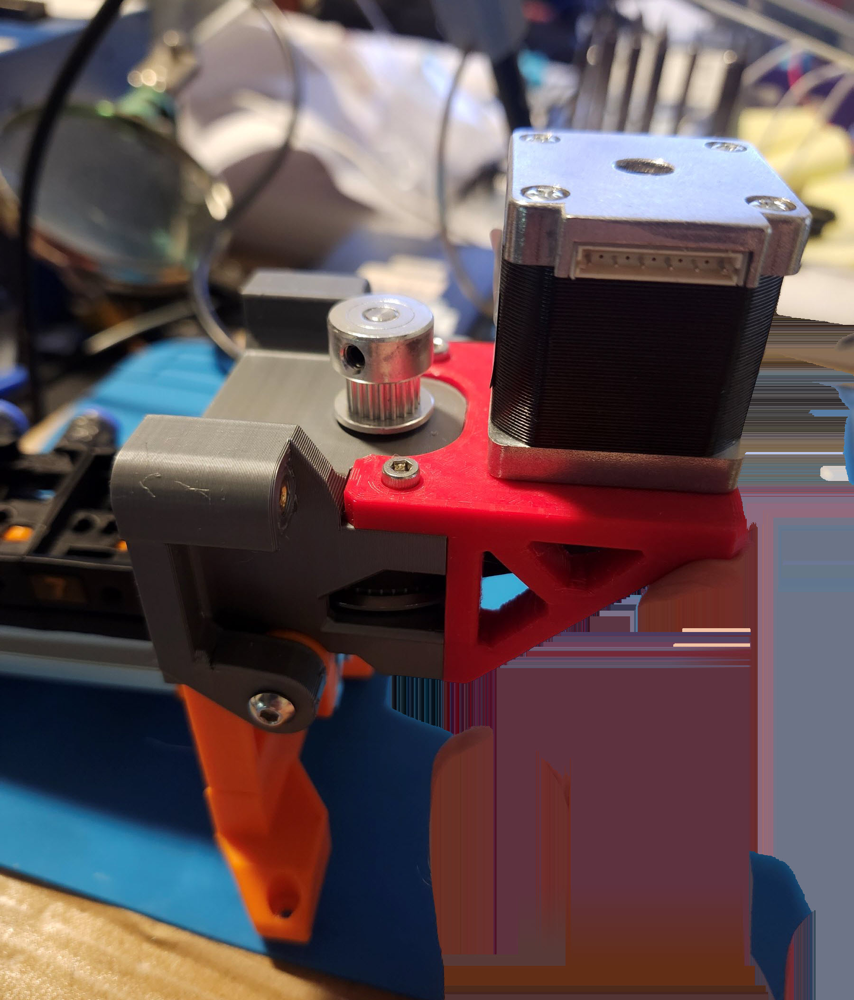
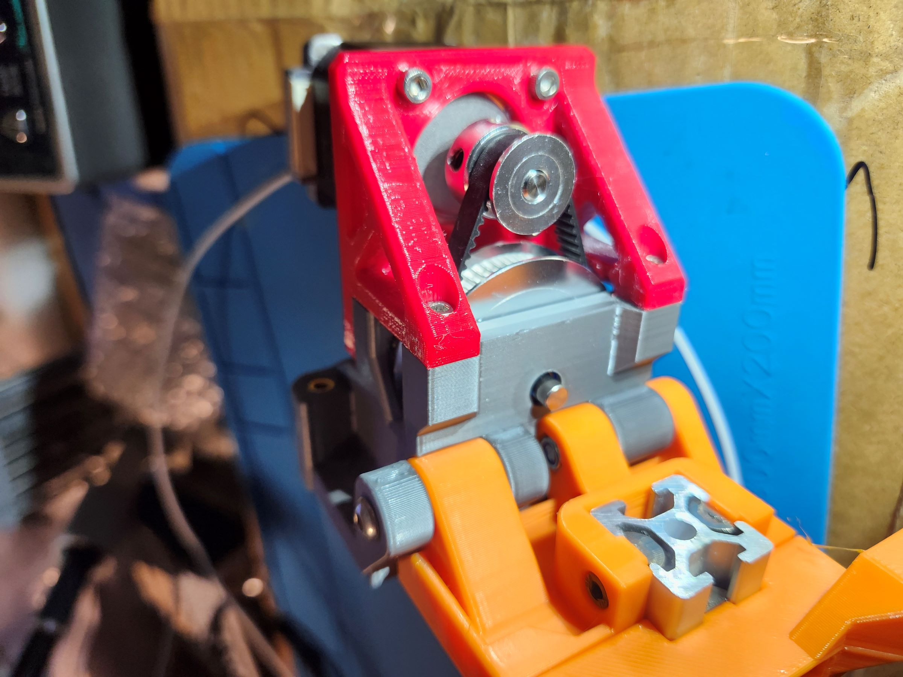

# ERCF V2 Selector Power Drive Mod 60T pulley

## What:
  A mod for Enraged Rabbit ERCF V2 MultiMaterial System. Use Pulley 60T and 20T (3:1) to drive the selector unit.
  
  
 
60T pulley drive selector system in action video
it first does a sensorless home and then move fast from gate 0 and gate 7
[https://youtu.be/REvJzBS2TxI]

## Why (Benefits):
  * Work with any size of Nema14 stepper motor. Nema17 stepper motor mount is not done since I don't have the need, but should be simple to make.
  * much more precise selector movement postion
  * stronger driving force.
  * reduce current draw from tmc2209 driver board 
  * pulley drving looks cool
  
    
   
## Problems to solve:
In ERCF V2 ( and V1 as well)'s original design there are these problems:
###  it uses a very short body type pancake style stepper motor and only.
Only this type of stepper motor can fit in the position since the place and space is very tight.
This is bad, a random stepper motor cannot fit.  
When I upgrade my ERCF V1 to V2, I realized that I didn't have another special pancake short body stepper motor to install.
and my regular NEMA14 stepper motor cannot fit in. So unless I remove the one from my ERCF V1 but I didn't want to do that since I needed it to work and print.
So the goal 1 is to make it work with any stepper motor, probably any size of nema14 at the moment since it's powerful enough( and I have a few)

### the selector movement is not precise enough,
since it uses one 20T pulley in stepper motor to drive the selector.

### the driving force seems a little weak
because it uses one 20T pulley in stepper motor to drive the selector. 

## Solution:
To solve all above problems, we can "simply" use a pulley driving system.
* So we can move the stepper motor mount position out of the tight place, so that any size of motor can fit in.
* use a 60T pulley and 20T pulley system to work with the 20T pulley on stepper motor, the movement precision is now much much better, 3 times better.
per my test, the selector movement distance delta is now usually from 0mm to 0.1mm ( log output from ercf software)
* now the driving force is 3 times of original ( 60T to 20T gear ratio)
* Reason to use CNC 60T pulley
 because it can easily fit in the place. 80T is too large, and it's very cheap

## BOM:
 * cnc 60T pulley (2GT, always 2GT type)
 * one more 20T pulley ( the same type of the ERCF original design for selector motor)
 * 154mm belt, (2GT close loop)
 * nylong washer M5 0.5mm thick, OD 7mm preferred. 3pcs. or you can print
 * nema14 stepper motor
 * M5 D shaft about 46mm to 50mm long, slightly longer or shorter shouldn't matter. if no D shape shaft is available, we can easily grind the place for pulley set screw.
 * bearing MR115 ( OD 11mm, ID 5mm, height 4mm )   2pcs
 * M3 screws , 8mm 2pcs,  10mm 4pcs, 12mm 2pcs
 * M3 hex nuts X2,
 * M3 heat insert X 2 ( and other heat inserts required by the original design)
 * may need a little bit longer open belt (the long open belt for selector) than the orignal ERCF_V2 design, since our 20T pulley is a bit further from the original position, since the 60T pulley need space to stay.
 ### optional 
only if plan use M4 screw to mount pulley_mount_default and EndBlock_Bypass
* M4 30mm X 2 
* M4 lock nuts X 2 

## File list
### stl files
* pulley_mount_default_M5.stl -- to replace the original Linear_Axis_Selector_Motor_Support.stl. ( Don't print this if you plan to use M4 screws)
* selector_motor_mount_nema14.stl -- a new part in this design, for the stepper motor. 

#### optional files:
* pulley_mount_M4.stl   use M4 screws to mount on the endblock_bypass. ( don't print above _M5 version if plan to use M4 screw)
* ERCF_V2_EndBlock_Bypass_M4.stl   replace the original ERCFV2's endblock bypass(M5), it use M4 screws.

### CAD files
  * fusion360 f3z files are provided
  * CAD step files are provided.
  
## Print Setting
  * 40% and 4 parameters (same the ercf or voron's print setting)
  * material PETG or ABS ( usually I don't use ABS when high temperature resistance is NOT needed), our stepper motor shouldn't produce more than minimum heat with correct setting.

## Optional parts and stl files for M4 screw:
 
 
  when I work on the project, I realize I don't have the required spare M5 long screws needed in the original design between endblock_bypass and EndBlock_Bypass part. 
  Generally speaking I don't like M5 screws, they are more expensive to buy, and more expensive to ship. therefore I don't have all sorts/length/screw head types of M5 screws in my part storage box. However M4 screw is a totally different story, it's very good for below reasons:
  * it's much cheaper to buy and cheaper to ship
  * more importantly it's strong enough for most day to day projects.
  * 3D designed plastic part can have smaller M4 holes instead of M5, so smaller hole, stronger parts, or smaller parts.
  therefore I converted two above parts to use 2pcs M4X30 (instead of M5X30) to mount together.
  so if you plan to use M4 screws, print those, if not, no need.

## Assembly Steps:
should be straight forward, basically just install the stepper motor and the pulley mount.
  
  
  
  1. decide to use M4 or M5 (ERCF default) screws. print all needed parts
  2. for the pulley_mount part
     * insert 2X heat insert in the pulley_mount part lower holes. (these two holes are for stepper motor mount part.)
     * insert other heat inserts according to the ERCF V2 document,I shall not repeat and copy paste all the same steps already in the ERCF doc.
     * insert 2X M3 nut under the pulley_mount part upper hole.
     * insert two bearing into the two holes in layer one and layer two.
     * install  D shaft, and in below order: 20T pulley , nylong wahser , upper bearing(in above step), nylong washer, 60T pulley, nylong washer, closed loop belt in pulley_mount part. lower bearing(in above step).   Do not forget the closed belt.
     * if the D shaft is too difficult to insert into the bearing, can grind the shaft with sand paper to make it slightly smaller. it happens with cheap D shaft and cheap bearing. things cannot automatically and perfectly fit together.
       
   
   
  3. for the selector motor mount part.
    install stepper motor from above, use 4X M3 8mm long screw to loosely mount, do not tighten, belt tightness need to be adjust later using these 4 screws.
  4. install 20T pulley to nema14 stepper motor,do not tighten pulley set screw.
  5. install motor mount part and pulley_mount part to gether. two M3 12mm screws on top (into the M3 nuts),  M3 10mm screw lower (into the heat insert)
   
  6. adjust stepper motor position, (it can move about 1.6mm) and tighten 4X M3 8mm screws. the 154mm closed belt need to be reasonably tight to make the sensorless homing work. Note, do not use wrong screw types, it may damage stepper motor hole thread. use M3 8mm only.
  now the motor and pulley assembly is finished.
  7. install the finished stepper motor and pulley assembly to the EndBlock_Bypass part ( M4 or M5 30mm screw depends which type you chose to print and use)

   
   
   
   
## Config file change
 * since we now use 60:20 gear ratio, so a new line is needed in the hw config file manual_stepper selector_stepper section -- gear_ratio: 60:20 .
> manual_stepper selector_stepper section
> 
> rotation_distance:40
> 
> microsteps: 16
> 
>  full_steps_per_rotation: 200	# 200 for 1.8 degree, 400 for 0.9 degree
> 
> gear_ratio: 60:20   <=== add this
	
## Configuration and Calibration
 * If sensorless homing doesn't work well, check the closed loop belt, if the belt is too loose, it cannot transfer the impact from the top 60T pulley to 20T pulley on stepper motor.
 * also check the long open belt on selector and 20T tightness.
 * hold current can be very small since we have 3:1 pulley system, ie hold_current: 0.005
 * if do not set this line, no hold current is set, klipper would use the run current the whole time, I think this is bad, printing and not printing.
 * run_current: 0.400 ( tested 300 to 400 work all good)
 * if run_current is set too low, it cannot drive the selector run with higher velocity and accel. I use velocity: 250 and accel: 200
 * driver_SGTHRS:75  higher value means more sensitive and easier to be stopped.  lower value means it's harder to be stopped.
 * feel free to experiment different driver_SGTHRS values and run_current, yes they are related per my understanding.

  
