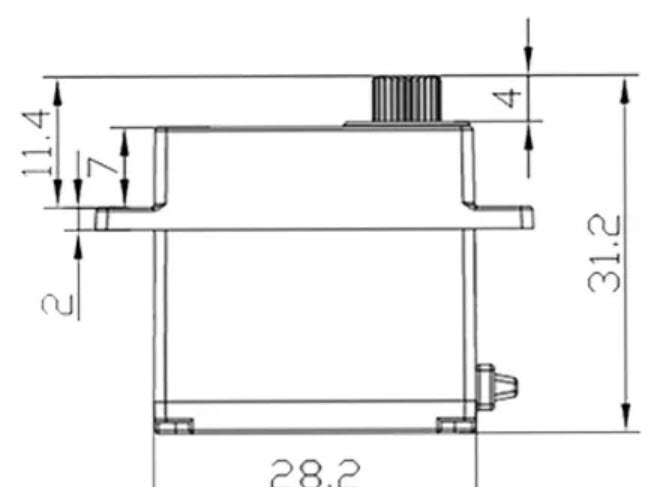
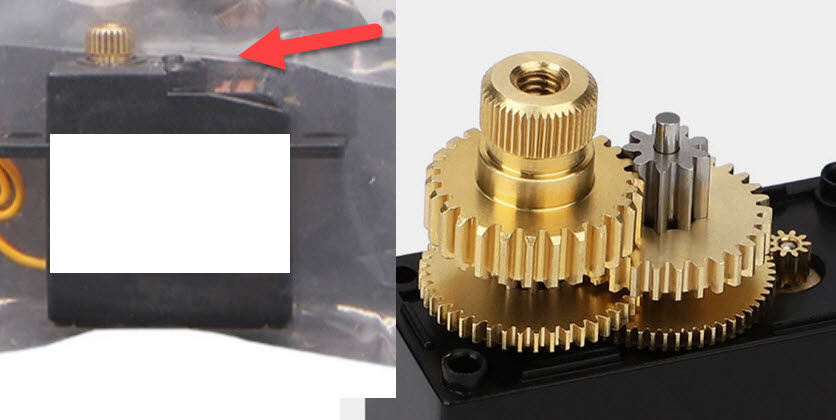
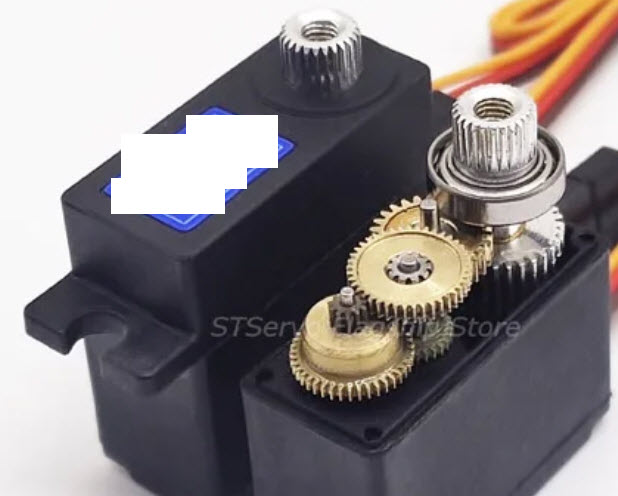
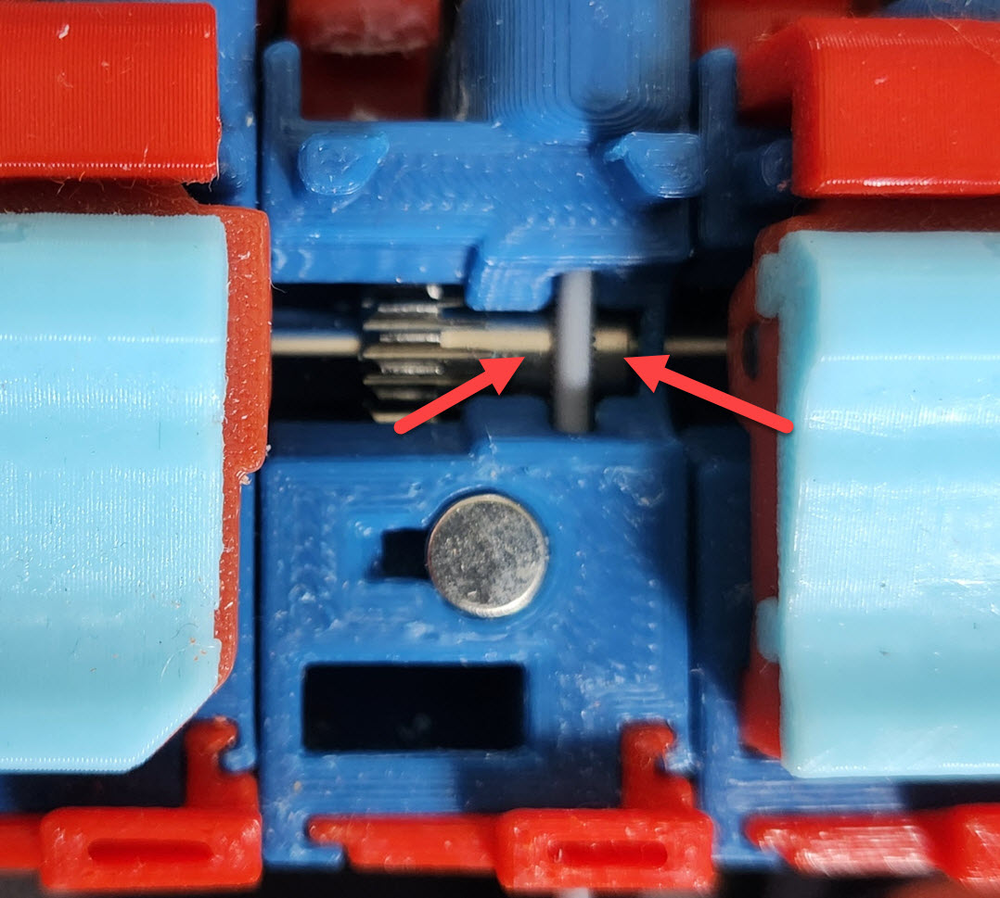
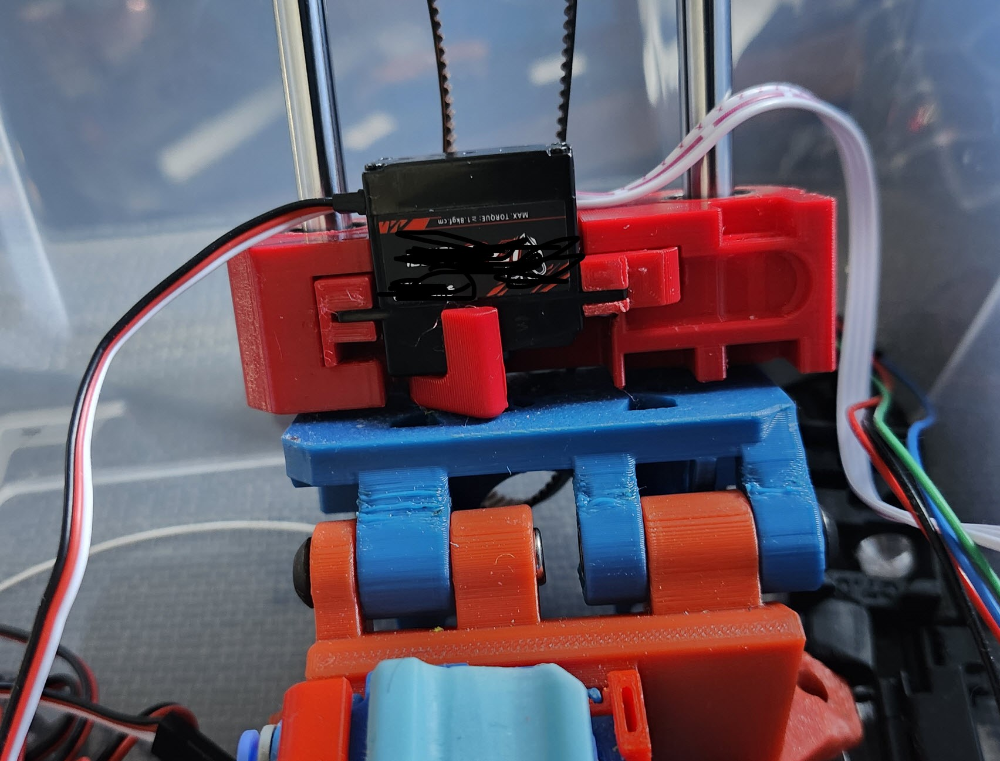
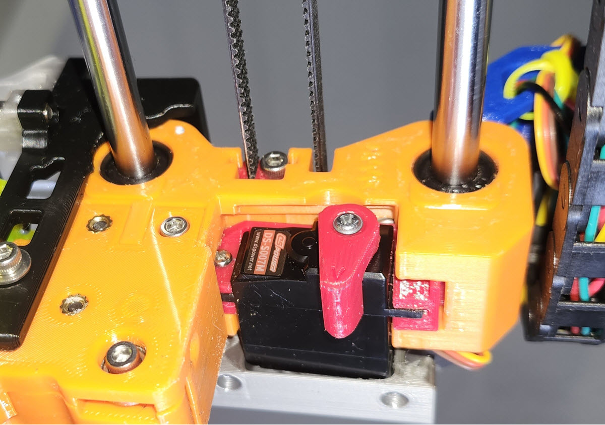

# ERCF V2 selector mod for larger 28mm servo

## What:
 for ERCF V2 enraged rabbit multimaterial system.
 In the ERCF V2 and V1 design, a 23mm micro servo is used.
 a small servo with that size usually is very weak, not have the required torque or force to push the servo arm and gear down.
 that sometimes creates problems not easy to identify, and causes a lot strange print problems.
 
## Why:
  
  ERCF V2 need a stronger servo with reasonable price.
  A cheap 23mm servo usually is too weak and sometimes has problem pushing down.
  I dislike the idea to use a very expensive high end (50$? 100$???) small 23mm servo that may or may not be able to output larger torque.
  
### many features of expensive small servo is meaningless in our application.
 
Also in our application, a multi-material system, 
* servo size doesn't matter or shouldn't matter, it's not a RC car, space is not extremely limited by the nature of the application; 
* servo weight doesn't matter, it's are not a RC helicopter,
* servo speed doesn't matter at all, 0.01 sec VS 1 sec push down the filament gear doesn't effect print speed or filament change speed.
so a lot of high end expensive servo's features are meaningless in our application, big money is wasted if we buy those.
ERCF only need enough force.
  
### make it work with low price.
So the goal of this mod is to make the ERCF V2 selector to work with a larger 28mm servo, a regular one, with reasonable or low price, so we can buy a cheap servo and have larger torque.
Design once, and benefit every single ERCF unit, is better than design small, but every unit please buy a 50$ 100$ expensive high end servo.  
  
With the larger size (28mm VS 23mm), a servo body can easier to contain larger gears, or more gears, and a larger motor, larger PCB IC driver, therefore it's easier to output larger torque or force. And because all things are easier for servo manufacturers, so a normal quality 28mm servo usually is cheap (6,7,8$, usually advertized 1.6kg ), and a better one is only about 15$ or 20$ ( usually advertized for 6kg, 7kg torque)
  

## Design consideration
I have to makethe selector body about 1.5mm thicker, to make the wire management channel work better, and the inner body simpler.
if we look into the inner body of the ercf v2 original selector, we can see some weird bump on side, that is for the wire channel. this thing makes things difficult. I wiped out the bump part.
with a thicker body the selector is now slightly stronger, hopefully.
I also installed it on ERCF V1 it works too

## File list
all stl files are in correct print orientation already, bottom side is facing down.
 * servo_28mm_holder.stl  servo holder for 28mm servo.
 * a]_Selector_for_servo28mm.stl  the ERCF selector main body. 
 * servo_arm_6mm_25T.stl   28mm servo usually have larger output torque, therefore they have 6mm dia output shaft VS 5mm from small 23mm servo. Note the upper side of the hole has no tooth, it's for printability, tooth up side down on top seems hard to print.
 * LinearAxisIdlerBlock.stl	the part need a slightly larger hole or cut out for 28mm servo to go in a little.
 * drag_Chain_Anchor_28mm_servo.stl   with a larger selector body, the original drag chain blocks the path, need to a little cut out for it. it has built in support, remove it after print.
 * servo_hole_filler.stl   X 2            28mm servos usually have a larger mount hole, too large for our 2mm tapping screw. 
   
### Optional files
   
 * LinearAxisIdler_Block_M4.stl   same as above, but this version works with M4 button head idle screw and hex and M4 idler. I don't have another M5 screw and M5 idler to make my mod. usually I don't like M5 screws, M4 screws are better in many ways. I have a lot M4 screws and M4 idlers. Ignore if you don't plan to use M4 screw/idler.
 * erec_beat6_encoder_mount_for_thicker_selector_28mm  make EREC filament cutter part to work with our modded selector body. our selector body is slightly thicker than the original. ignore if you don't use EREC filament cutter. ( ERCF_Filament_Cutter https://github.com/kevinakasam/ERCF_Filament_Cutter/tree/main )
	  
###  CAD source files
 Step files and fusion360 F3Z files are provided.
   
### Test Gcode file
ercf_selector_and_servo_test.gcode to home and do servo down servo up in every selector position
      
## Print setting
* no support needed.
* usually setting for voron or ERCF
* PETG works. I don't use ABS for non heat require parts but ABS should work too.
   
## BOM
  * M2.6 8mm long tapping screw X 2 for servo mounting.
   The servo's accessory bag usually doesn't contain this right type of screw. they are usually larger and longer, cannot fit in our selector body.
  * a 28mm servo, 28mm means the main body size width, not the mounting part/mounting arm or hole. 
  * not all 28mm servos are made the same. some are more expensive, some have bearing on output shaft, some are using just plastic case act as bearing.
    * I am guessing, if a servo's the top body part is full and flat, it may have more gears; if top body part is just a round shape, it has less gears (less torque, lower cost, cheaper). I recommend buy the ones with more gears but they are usually a bit more expensive. YMMV
    * below picture, the servo has half top body part, meaning it has less gears. usually cheaper, also Should be enough force
    
    * below picture, the servo has a full flat top body part, meaning it may has more gears (better, more torque), this servo even has a bearing, that's even better. so this one should be better
    
    * also can check servo mounting arm, thicker arm May mean more torque. I saw some arms are 1.6mm , 1.8mm and 2mm.
	
## Assembly Steps

### selector part
*  print and remove selector built-in support, 3 of them.
* put servo_hole_filler part X 2 in two servo mounting holes. 28mm servos usually have larger mounting hole, 4mm dia, but we plan to use 2.6mm  
	  tapping screw. install servo in the servo holder. note the orientation. 
* Just follow the ERCF V2 document. no other new step/special step is needed.
* don't install servo arm part yet.
* connect servo connector. Pay attention to BTT MMB connector's order, which is 5V, GND, Signal, but most servo connector is GND, 5V, Signal, different. so don't mess don't fry the servo or worse.

### drag_Chain_Anchor_28mm_servo
* remove built-in support and follow ERCF V2 document.
	  
###  A tip for installing servo arm:
* recommend not to install servo arm until everything else is ready. 
* when all things are ready, run a ERCF_TEST_SERVO VALUE=20 command in command window, to let servo go to 20 degree. so we have room to go even smaller degree if needed, for servo up position.
* install servo arm to UP position, tighten arm screw (from servo accessory bag, a 2mm machine short screw), check servo arm is very close to servo body.
* Do not set too small or too large degree for the servo arm impossibe to reach, ie blocked by the top hat part physically. That will make the servo try very very hard to reach but impossible and servo motor will keep producing a lot of heat and fried and damaged in short time.
* Run ERCF_TEST_SERVO VALUE=50 , watch, and 60 watch, and 70 and more and watch, run it and watch servo arm, find a degree for servo arm to correctly push down the filament block top hat part. 
* Your millage may vary but my up and down angle is about 73 degree. 
* after servo up and down degree is set in the ercf parameter file, restart firmware to make it effective.
* run ercf_servo_up,  and look at servo arm NOT touching the servo body. If it touches it, it may try hard to reach an impossible position, servo will get damage. check the body temperature for 1-2-3 minutes, it shouldn't be hot at all. If servo arm try to touch the body, increase the up degree by 1 or 2 and test again.
* run servo down, and let it stay, check servo body temperature for 1-2-3-4-5 minutes, it shouldn't be hot at all. If servo arm try to reach a impossible position, reduce the degree by 1 or 2 and test again. it shouldn't be colder than warm. Hot is not acceptable.
* more power, means easier to get damaged, need to be more careful. servo angle need to be treated carefully, it must be correct.
* If possible, can use lab DC power supply to test servo current, when in UP and Down position, the current draw should not be larger than 100ma. If current is more than that, it means the servo is trying to go to a position that it couldn't. the angle need adjust. If no power supply or too lazy to work the wires, can just feel the servo body temperature.
	 
### adjust all filament block's postion setting in ERCF parameter file.
 the new selector body is 1.5mm thicker than the original one in ERCF V2, therefore I'm afraid the value in the file need change accordingly and test.
  >  colorselector: 1.8, 26.0, 48.6,  71.6, 95.0 , 118.0, 141.0, 164.2

### trouble shooting for servo arm push down problems
if servo arm cannot push down correctly. check below things
* when push down, servo arm must not touch other top hat part, it should only push down the selected filament block's top hat part. If it touches the adjacement top hat part, obviously that part blocks it. need correctly set the value of the selector filament position.
* load a piece of filament inside filament block, check filament is exactly in the middle of the bondtech gear teeth, the correct position.
 If it's not in the correct position, obviously the filament is higher, therefore servo arm and top hat cannot push down. Check ERCF V2 manual page 69.
* In below picture the filament is a little bit too left, so we need to loose the bondtech gear set screw and move it a little to right, can hold down the filament hard to help to position the gear. May use weak type thread locker (222, purple etc) liquid. Do not recommend use medium strength type.
   ercf V1 filament block is shown, but the idea is the same
   
 
 
 * if servo arm's contact surface is too coarse, can use file/sandpaper a bit to make it smooth, it should be easier to move on the surface of top hat part.
 * no other improvement or even a 30mm 40mm larger stronger super servo makes sense with above problems existing.

selector with 28mm installed in ERCF V1

selector with 28mm installed in ERCF V2

   
   
### other optional enhancement

If needed, can consider below optional enhancement to make servo work even better
* apply silicone grease on all top hats if needed, so servo arm can move easily on the top hat surface.
* use a standalone DC DC buck converter to convert 24V main power to 6V (6.5V ? 7V? YMMV) for servo, capable of 2A or even 3A+ current output. If you know electricity, consider adding a larger capacitor for strong and stable power output. The benefit is to release BBT MMB mainboard from stress of servo, and if things go wrong, BTT MMB doesn't get fried. and of course with 6V or even 7V , our servo can produce even larger torque.
* EREC filament cutter mod can share above buck converter.  (ERCF_Filament_Cutter  https://github.com/kevinakasam/ERCF_Filament_Cutter/tree/main)
	 
	 
     
